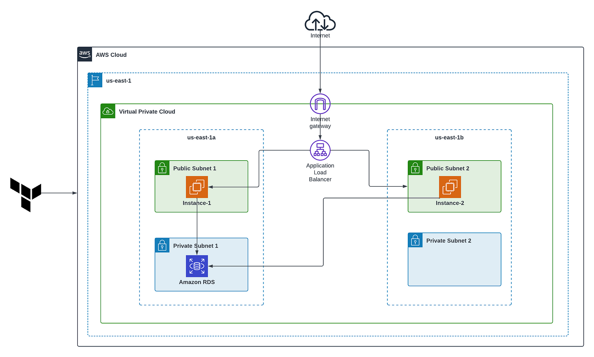

# 🏗️ AWS Highly Available 2-Tier Architecture Setup (Console-Based)

This guide provides step-by-step instructions to set up a highly available and secure infrastructure on AWS using the AWS Management Console.

---

## 🖼️ Architecture Diagram

---

## 🌐 Components Overview

- **VPC** with CIDR block `10.0.0.0/16`
- **2 Public Subnets** (for EC2 + ALB) across 2 AZs
- **2 Private Subnets** (for Amazon RDS) across 2 AZs
- **Internet Gateway** attached to public subnets
- **Application Load Balancer** for distributing web traffic
- **EC2 Instances** in public subnets
- **Amazon RDS** instance in private subnets
- **Route Tables** for routing internet traffic
- **Security Groups** for secure access

---

## 🧰 Step-by-Step Guide

### 1. Create VPC

1. Go to **VPC > Your VPCs > Create VPC**
2. Name: `my-vpc`
3. CIDR block: `10.0.0.0/16`
4. Enable DNS resolution and hostname
5. Click **Create VPC**

### 2. Create 4 Subnets

#### Public Subnets:
- `10.0.1.0/24` in `us-east-1a` (PublicSubnet1)
- `10.0.2.0/24` in `us-east-1b` (PublicSubnet2)

#### Private Subnets:
- `10.0.3.0/24` in `us-east-1a` (PrivateSubnet1)
- `10.0.4.0/24` in `us-east-1b` (PrivateSubnet2)

### 3. Internet Gateway

1. Create IGW → Attach to VPC `my-vpc`

### 4. Route Tables

- Public RT → `0.0.0.0/0` → Target: Internet Gateway
- Associate with both public subnets

### 5. Security Groups

#### EC2 SG:
- Inbound: SSH (22), HTTP (80), HTTPS (443) from your IP
- Outbound: All traffic

#### RDS SG:
- Inbound: MySQL/Aurora (3306) from EC2 SG

### 6. Launch EC2 Instances

- AMI: Amazon Linux 2023
- Network: `my-vpc`, Subnet: PublicSubnet1 and 2
- Assign public IP: Enable
- Add EC2 SG

### 7. Create Application Load Balancer

- Type: Application (ALB)
- Scheme: Internet-facing
- Subnets: PublicSubnet1 and 2
- Create Target Group: add both EC2s
- Listener: HTTP on port 80 → forward to TG

### 8. Launch Amazon RDS

- DB: MySQL/PostgreSQL
- VPC: `my-vpc`, Subnets: PrivateSubnet1 and 2
- Public Access: No
- Security Group: RDS SG

### 9. Test

- ALB DNS → Should open EC2 page
- SSH to EC2 → `mysql -h <RDS-endpoint> -u admin -p`

---

## ✅ Best Practices

- Use Multi-AZ for RDS
- Enable CloudWatch for logs
- Use IAM roles for secure access
- Use NAT Gateway for private subnets if needed

---

## 🔐 Security Summary

- Public traffic only to ALB
- EC2 only exposed through ALB
- RDS in private subnet with access only from EC2 SG
- Minimum IAM permissions used
